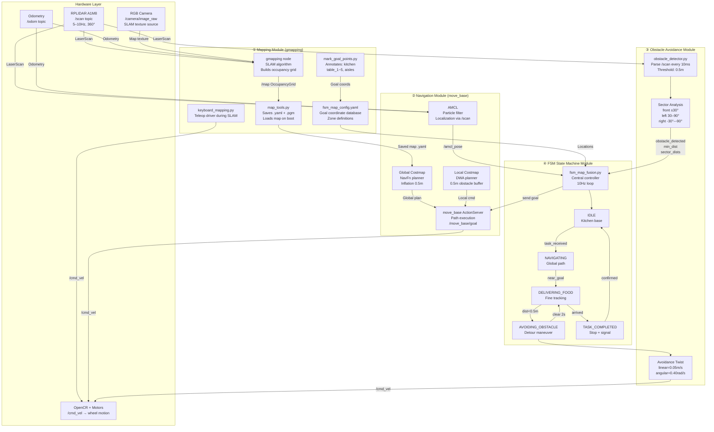
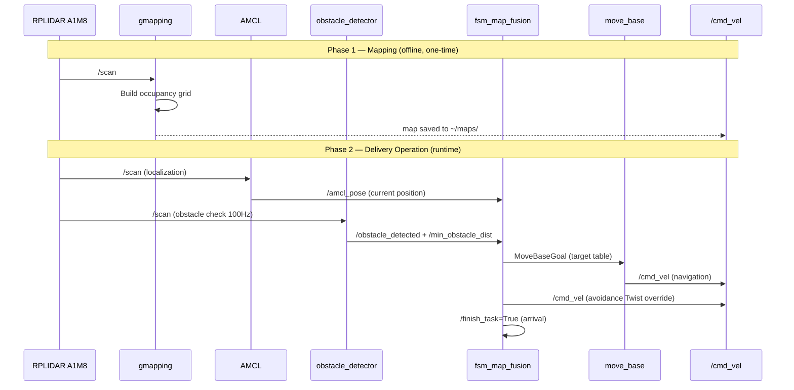

# Map Architecture Design
## TurtleBot3 Waffle — Simulated Restaurant Food Delivery

---

## 1. Overall System Architecture Flowchart



---

## 2. Module Division

### Module ① — Mapping Module
| File | Function |
|------|----------|
| `keyboard_mapping.py` | Drive robot via WASD keys while gmapping builds the map |
| `gmapping_params.yaml` | RPLIDAR A1M8-tuned SLAM parameters |
| `map_tools.py` | Auto-save map to `~/maps/`, load on startup |
| `mark_goal_points.py` | Click-to-mark kitchen & table coordinates in RViz |
| `fsm_map_config.yaml` | Persisted restaurant location database |

### Module ② — Navigation Module
| File | Function |
|------|----------|
| `costmap_common_params.yaml` | Shared costmap settings: inflation_radius=**0.5m** |
| `move_base_params.yaml` | Planner frequencies, recovery behaviors |
| `navigation.launch` | Launches AMCL + map_server + move_base |

### Module ③ — Obstacle Avoidance Module
| File | Function |
|------|----------|
| `obstacle_detector.py` | 100Hz scan parsing, 0.5m threshold, sector analysis |
| `dwa_params.yaml` | Local planner speed caps (delivery=0.15m/s, avoidance=0.05m/s) |

### Module ④ — FSM State Machine Module
| File | Function |
|------|----------|
| `fsm_map_fusion.py` | **Master controller**: fuses map knowledge + LiDAR + AMCL into 5-state FSM |
| `fsm_core.py` | Original FSM engine (used by fsm_map_fusion as base class) |
| `task_manager.py` | Task queue management |

---

## 3. Inter-Module Data Flow



### Topic Communication Summary

| Topic | Publisher | Subscriber | Message Type | Rate |
|-------|-----------|------------|-------------|------|
| `/scan` | RPLIDAR driver | gmapping, AMCL, obstacle_detector, fsm | LaserScan | 10Hz |
| `/odom` | OpenCR | gmapping, AMCL, move_base | Odometry | 30Hz |
| `/map` | gmapping / map_server | move_base, RViz | OccupancyGrid | 1Hz |
| `/amcl_pose` | AMCL | fsm_map_fusion | PoseWithCovarianceStamped | 10Hz |
| `/cmd_vel` | move_base / fsm (avoidance) | OpenCR | Twist | 10Hz |
| `/obstacle_detected` | obstacle_detector | fsm_map_fusion | Bool | 100Hz |
| `/min_obstacle_dist` | obstacle_detector | fsm_map_fusion | Float32 | 100Hz |
| `/robot_state` | fsm_map_fusion | task_manager, RViz | String | 10Hz |
| `/finish_task` | fsm_map_fusion | task_manager | Bool | on-event |
| `/delivery_task` | CLI / task_manager | fsm_map_fusion | String | on-event |
| `/marked_goals` | mark_goal_points | fsm_map_fusion | String (JSON) | on-event |

---

## 4. Restaurant Map Zone Layout

```
┌─────────────────────────────────────────────────────────────┐
│                    RESTAURANT MAP                           │
│                                                             │
│  ┌──────────┐    DELIVERY AISLE         ┌───────────────┐  │
│  │          │   ════════════════════   │  DINING AREA  │  │
│  │ KITCHEN  │──►  table_1 (3.0, 2.0)   │               │  │
│  │          │──►  table_2 (3.0,-2.0)   │  T1  T2  T3  │  │
│  │[0.0,0.0] │──►  table_3 (6.0, 0.0)   │               │  │
│  │          │──►  table_4 (6.0, 3.0)   │  T4  T5      │  │
│  └──────────┘──►  table_5 (8.0,-1.5)   └───────────────┘  │
│                                                             │
│  ← Floor tape marks zone boundaries                        │
│  ← Update coordinates in fsm_map_config.yaml after mapping │
└─────────────────────────────────────────────────────────────┘
```
