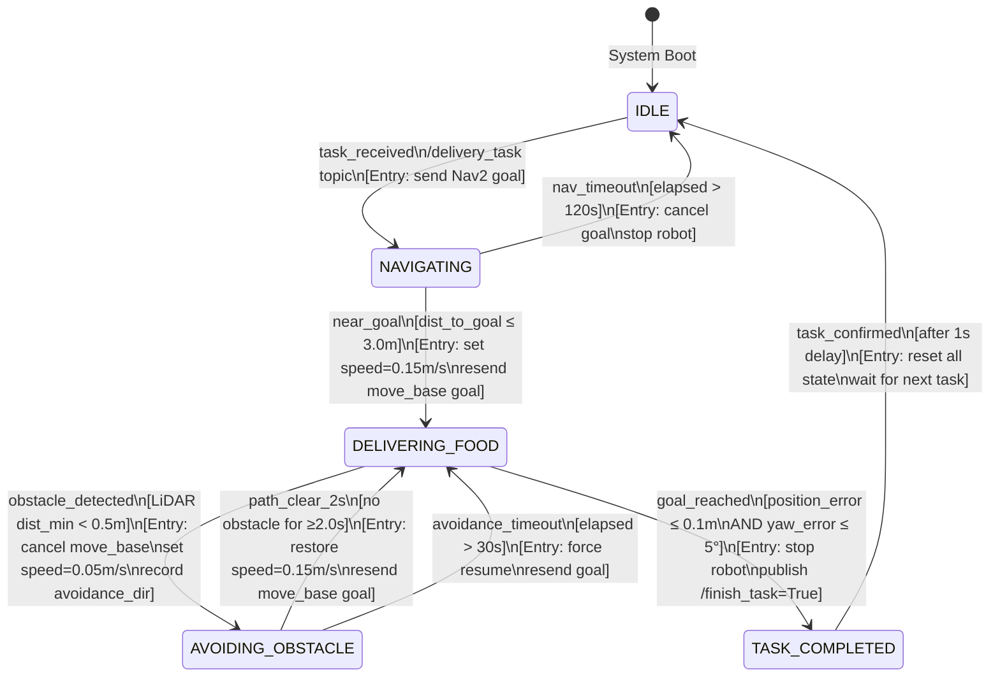
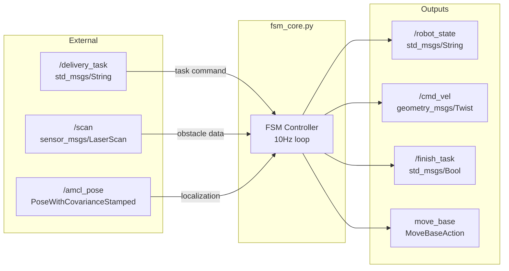

# FSM State Transition Diagram
## TurtleBot3 Waffle Food Delivery Robot

Render this file in any Mermaid-compatible viewer:
- VS Code: install "Markdown Preview Mermaid Support" extension
- GitHub: renders automatically in `.md` files
- Online: https://mermaid.live

---

## Full FSM Diagram



---

## Sensor Fusion Flow Diagram

```mermaid
flowchart TD
    subgraph SENSORS["Sensor Layer (10ms cycle)"]
        A[RPLIDAR A1M8\n/scan @ 5-10Hz]
        B[RGB Camera\nSLAM Map Source]
    end

    subgraph PROCESSING["Processing Layer"]
        C[obstacle_detector.py\nFilter 0.5m threshold\nSector: front/left/right]
        D[AMCL Localization\n/amcl_pose\nMap + LiDAR fusion]
    end

    subgraph FSM["FSM Decision Layer (100ms cycle)"]
        E{obstacle_detected?\ndist_min < 0.5m}
        F{goal_reached?\nerror ≤ 0.1m + 5°}
        G{path clear?\n≥ 2.0s no obstacle}
    end

    subgraph ACTUATOR["Actuator Layer"]
        H[move_base\nDWA Local Planner\nGlobal NavFn]
        I[/cmd_vel\nTwist commands]
    end

    A -->|LaserScan| C
    B -->|Map tiles| D
    C -->|/obstacle_detected\n/min_obstacle_dist| E
    D -->|pose estimate| F
    E -->|YES: trigger AVOIDING| I
    E -->|NO: continue| H
    F -->|YES: trigger COMPLETED| I
    G -->|YES: trigger DELIVERING| H
    H -->|velocity| I
```

---

## State Action Table

| State | Entry Action | Loop Action | Exit Action |
|-------|-------------|-------------|-------------|
| **IDLE** | Stop robot (`/cmd_vel = 0`) | Poll `/delivery_task` | Save goal pose |
| **NAVIGATING** | Send move_base goal at 0.15m/s | Check dist_to_goal, nav timeout | — |
| **DELIVERING_FOOD** | Resend move_base goal at 0.15m/s | Monitor LiDAR + AMCL | Preserve saved goal |
| **AVOIDING_OBSTACLE** | Cancel move_base, set 0.05m/s | Publish avoidance Twist cmd | Stop robot, reset timers |
| **TASK_COMPLETED** | Stop robot, publish `/finish_task=True` | Wait 1s | Reset current_goal |

---

## Topic & Service Map


